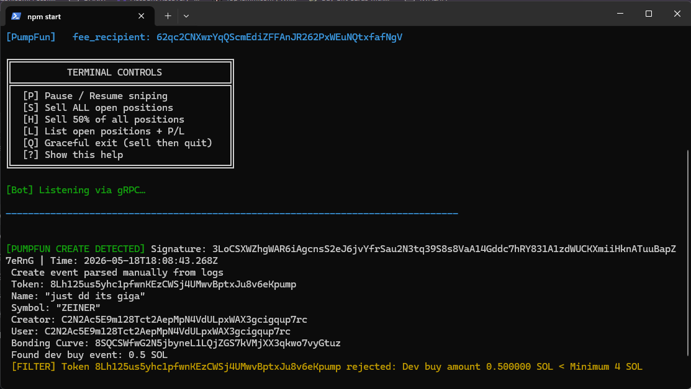
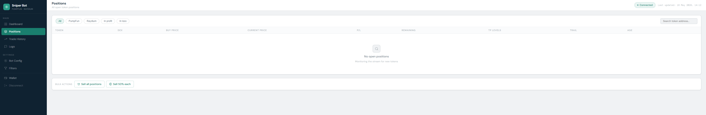
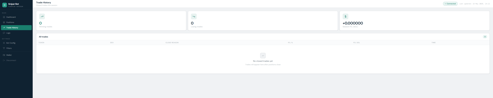
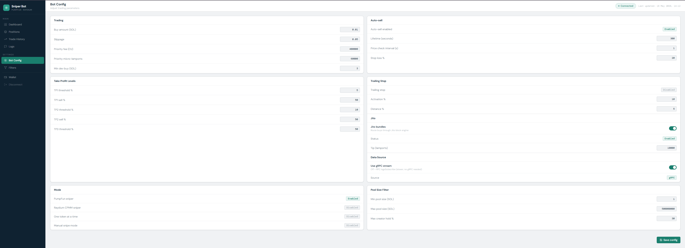
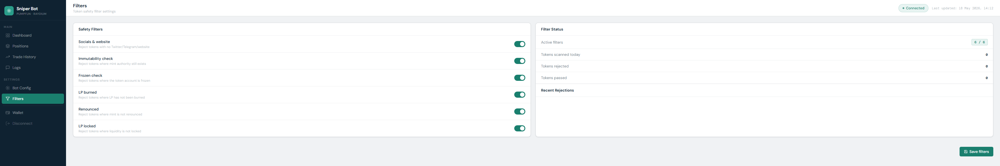
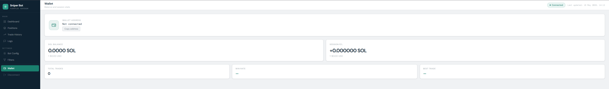

<div align="center">
  <h1>APEX Sniper</h1>
  <h2>Pumpfun Gem/Auto Sniper</h2>
  <p>Free Trial from CryptoBots.tech team</p>
  
  
<p align="center">
  
  
</p>

  
  
  [](https://opencollective.com/fakerjs#section-contributors)
  [](https://opencollective.com/fakerjs)
  
</div>



## 🚀 Features








## 📦 Install

OPTION 1, Buy the Premium bot with 7 Pre-Tested strategies and Gem Hunting Filters:
  
  [](https://cryptobots.tech/product/apex-sniper-bot)
  
OPTION 2 for Linux, Windows and Mac users that want to run the free trial:
  
1. Download nodejs for your PC from nodejs.org -> Read the README

2. Double click start.bat for windows users, or start.sh for mac after making it executable
   
3. If you want to run in terminal
```
npm start
```


## 🔑 License

[MIT]
